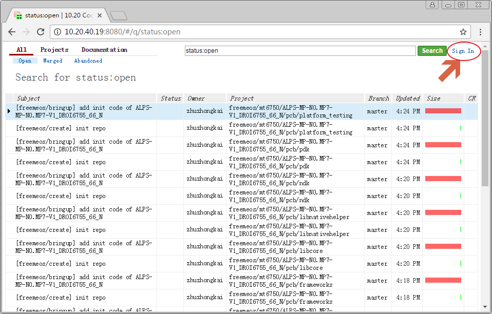
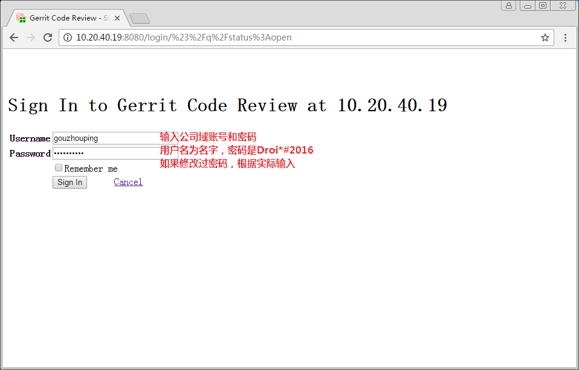
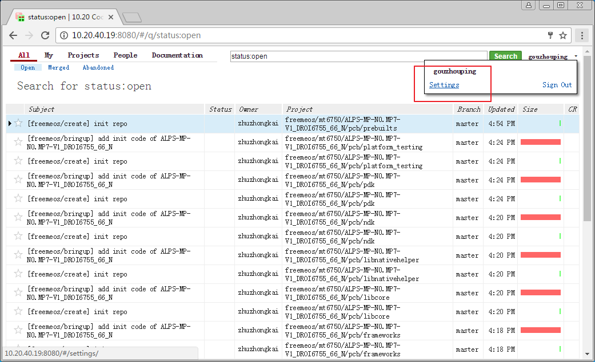
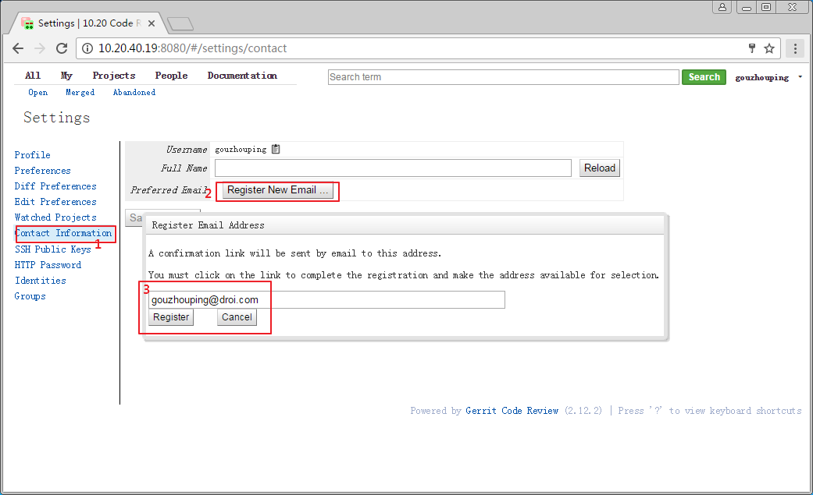
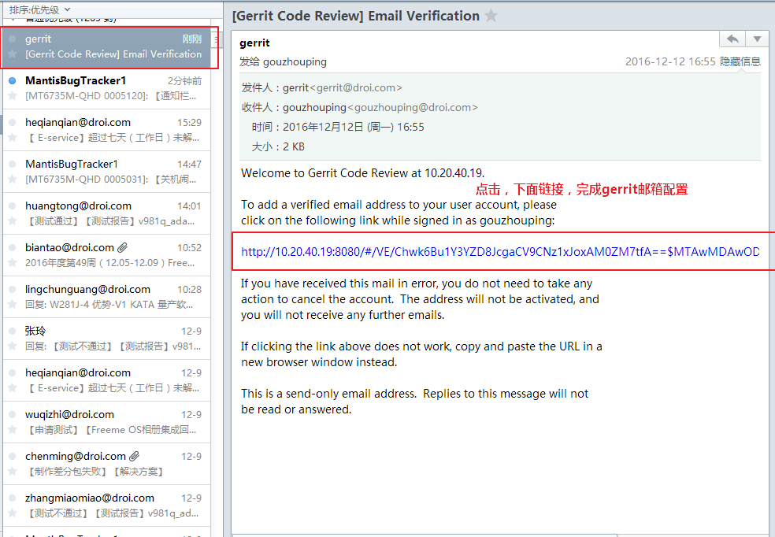
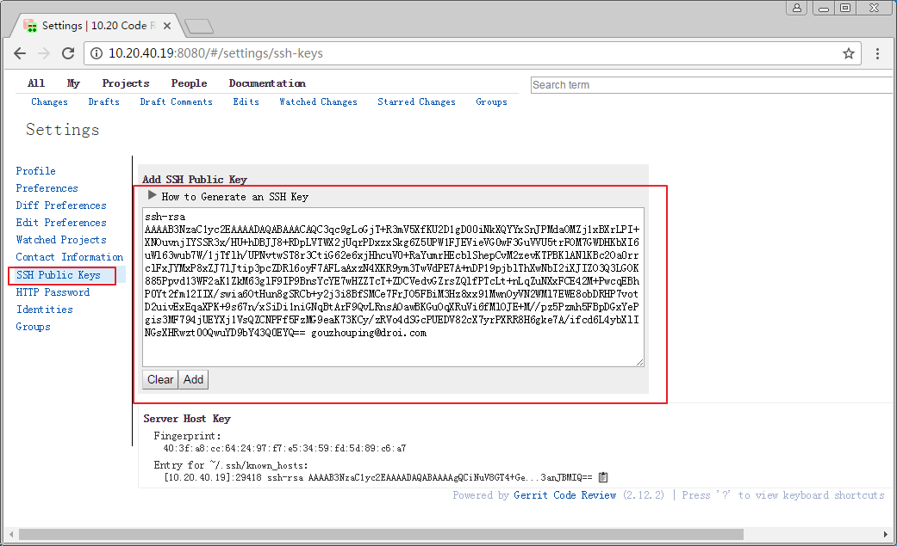
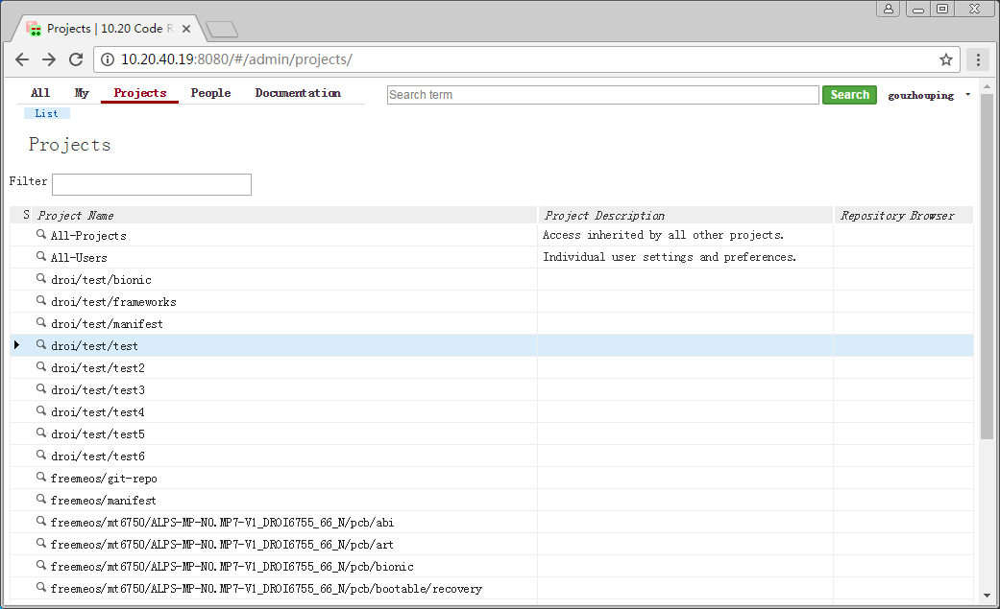
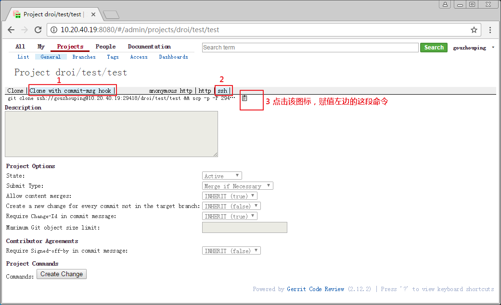

# git/repo配置

### 安装git

已知ubuntu14.04使用的git（版本1.9）版本过低，使用gerrit（版本2.12）配合使用有bug，安装最新的git，命令如下。

```
$ sudo add-apt-repository ppa:git-core/ppa
$ sudo apt-get update
$ sudo apt-get install git
$ git version                                                                                                                                                    [16:24:46]
git version 2.11.0
```

PS. ubuntu 16.04官方源中的git无此问题，可直接使用`sudo apt-get install git`安装即可，不必

### 配置Git

请把下面的`your_name`替换为自己的名字。
```
git config --global core.editor vim
git config --global user.email "your_name@droi.com"
git config --global user.name "your_name"
```

### 生成ssh-key

```
ssh-keygen -t rsa -b 4096 -C "your_email@droi.com"
```

之后需要输入，一直回车即可。执行完毕后生成`~/.ssh`目录.

## 下载安装repo命令

```bash
mkdir ~/bin
PATH=~/bin:$PATH
curl https://storage.googleapis.com/git-repo-downloads/repo > ~/bin/repo
chmod a+x ~/bin/repo
```

# 配置gerrit

## 登陆
首先登陆gerrit，公司内网地址：[http://10.20.40.19:808](http://10.20.40.19:8080)



用户名与密码是公司域账号，用户名为名字全拼，密码默认是`Droi*#2016`，如果自己修改过域账号密码，请根据修改后密码。



## 配置邮箱







## 添加ssh-key

首先确保已经生成了ssh-key，如果未生成，请参考本文第一节生成。
打开`~/.ssh/id_rsa.pub`文件，把全部内容按照下图配置。可以配置多个ssh-key。



## 拉取项目测试




在ubuntu机器上打开终端，执行如下命令

```
git clone ssh://gouzhouping@10.20.40.19:29418/droi/test/test && scp -p -P 29418 gouzhouping@10.20.40.19:hooks/commit-msg test/.git/hooks/
```

修改代码后，提交到gerrit上，命令如下

```
git push origin HEAD:refs/for/master
```


# 下载代码 `ALPS-MP-N0.MP7-V1_DROI6755_66_N`代码

1. 初始化repo仓库
```
mkdir droi6755_android_n
cd droi6755_android_n
repo init --no-repo-verify -u ssh://zhuzhongkai@10.20.40.19:29418/freemeos/manifest -m ALPS-MP-N0.MP7-V1_DROI6755_66_N.xml
```

2. 同步代码
```
repo sync
```

3. 创建本地master分支
```
repo start --all master
```